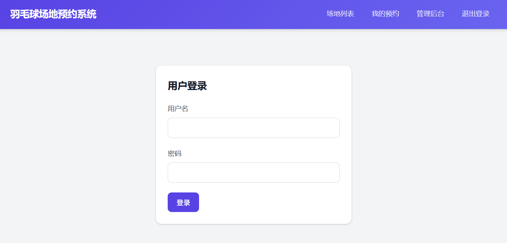
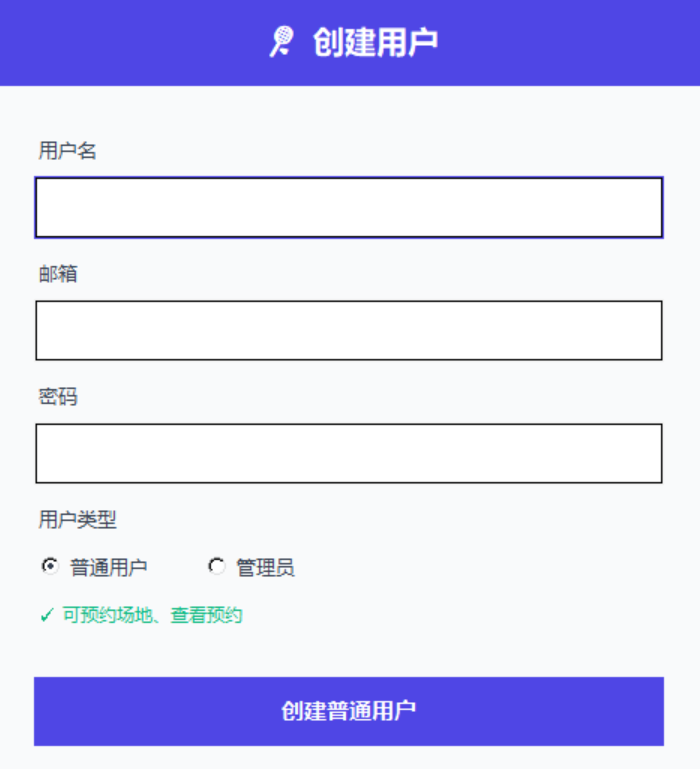
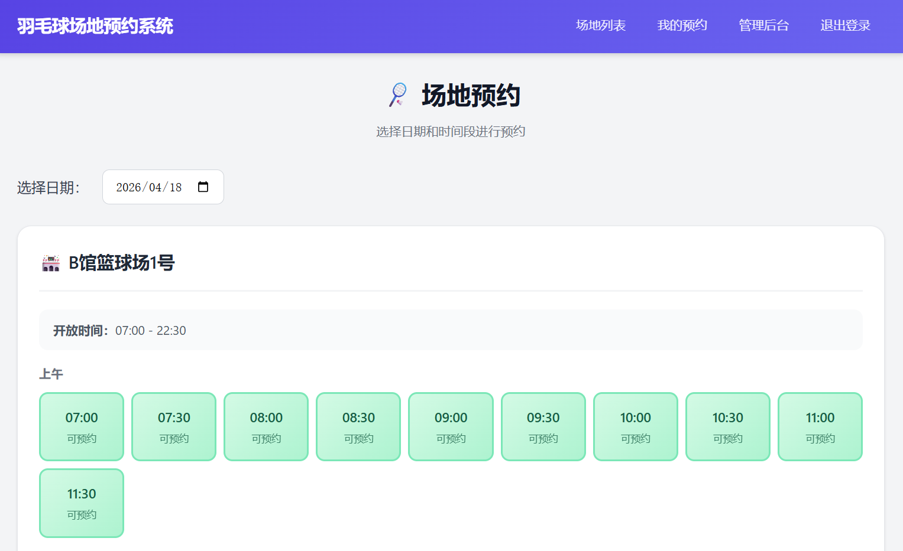

# 体育场馆预约系统

一个简单易用的体育场馆在线预约系统。

---

## 系统功能（简要说明）

### 用户功能
- 选择场地和预约时间
- 预约时间以半小时为单位（9:00-9:30、9:30-10:00等）
- 查看和取消自己的预约

### 管理员功能
- 管理场地（增删改）
- 设置场地可预约的日期范围和每天开放时间
- 查看所有预约记录
- 帮助用户预约或取消场地

---

## 界面预览

### 登录页面


### 创建用户


### 场地预约


---

## 快速开始（零基础用户）

### 第一步：安装Python

1. 访问 https://www.python.org/downloads/
2. 下载最新版本的Python（选择Windows installer）
3. 安装时**务必勾选"Add Python to PATH"**
4. 安装完成后，按 `Win+R` 输入 `cmd` 打开命令提示符
5. 输入以下命令验证安装成功：
   ```
   python --version
   ```

### 第二步：安装Django

在命令提示符中执行：
```
pip install django
```

### 第三步：下载并解压项目

1. 下载项目代码并解压到任意目录
2. 记住解压后的文件夹路径，例如：`D:\StaduimBookingSystem`

### 第四步：初始化数据库

1. 打开命令提示符
2. 进入项目目录：
   ```
   cd D:\StaduimBookingSystem
   ```
3. 执行数据库迁移：
   ```
   python manage.py migrate
   ```

### 第五步：创建用户

在项目目录下执行：
```
python create_user.py
```

运行后选择用户类型：
- **管理员**：可访问管理后台，管理场地、时间段、预约
- **普通用户**：可预约场地、查看和取消自己的预约

### 第六步：启动系统

在项目目录下执行：
```
python manage.py runserver
```

### 第七步：访问系统

打开浏览器，访问：http://127.0.0.1:8000/

---

## 使用指南

### 管理员首次使用

1. 登录后点击"管理后台"
2. 点击"场地管理" → "添加场地"，添加羽毛球场地
3. 点击"可用时间段管理" → "设置时间段"：
   - 选择刚添加的场地
   - 设置开始日期和结束日期（如：2026-04-15 到 2026-12-31）
   - 设置每天开放时间（如：08:00 - 22:00）
4. 场地设置完成！

### 普通用户预约

1. 登录后进入"场地列表"
2. 选择预约日期
3. 点击可用的时间段（绿色方块）
4. 点击"确认预约"
5. 在"我的预约"中可查看和取消预约

---

## 常用命令

```bash
# 启动服务器
python manage.py runserver

# 创建数据库变更（如修改了models.py）
python manage.py makemigrations
python manage.py migrate

# 创建用户（支持管理员/普通用户）
python create_user.py
```

---

## 注意事项

1. 时间必须是整点或半点，如 9:00、9:30、10:00
2. 预约时间不能与他人预约冲突
3. 管理员可取消任何用户的预约
4. 关闭命令提示符即关闭服务器，需重新运行 `runserver` 启动
5. 用户类型由 Profile 模型控制，与 Django 内置的 is_staff/is_superuser 独立
